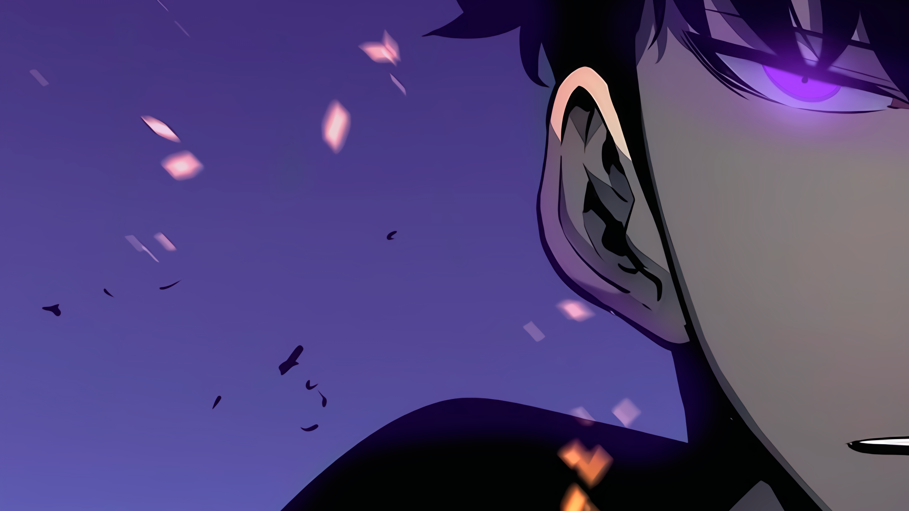
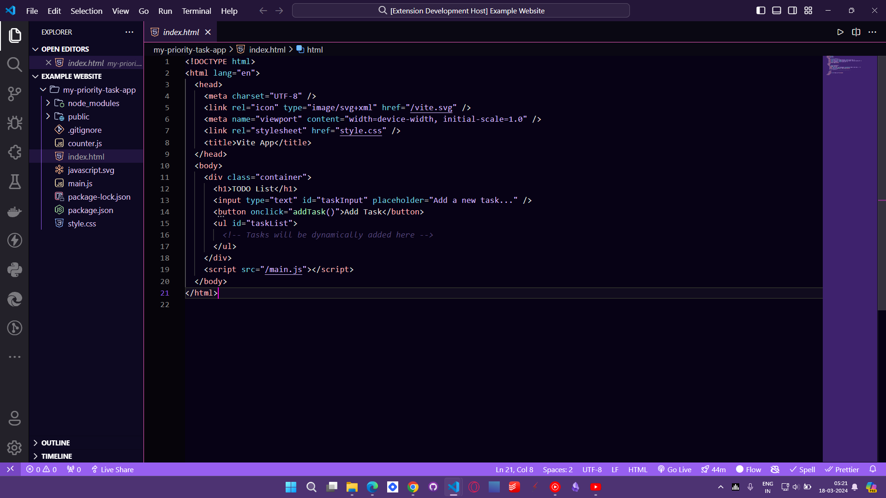

# t3nsor-solo-leveling README

# Purple VS Code Theme - Solo Leveling Inspired

## Overview

This Visual Studio Code (VS Code) theme is inspired by the aesthetic and colors of the popular anime series "Solo Leveling". It features a rich purple color palette reminiscent of the mysterious and thrilling atmosphere of the show.

## Screenshots

### Dark Mode

## Installation

1. Open VS Code.
2. Go to the Extensions view by clicking on the square icon in the sidebar or pressing `Ctrl+Shift+X`.
3. Search for "Purple Solo Leveling Theme".
4. Click Install to install it.
5. Once installed, go to File > Preferences > Color Theme and select "Purple Solo Leveling Theme" from the list.

Enjoy coding with a touch of the Solo Leveling vibe!

## Contact

Feel free to reach out to me if you have any questions, suggestions, or just want to connect:

- Website: [https://digbijayalenka.netlify.app/](https://digbijayalenka.netlify.app/)
- Twitter: [https://twitter.com/DigbijayaL](https://twitter.com/DigbijayaL)